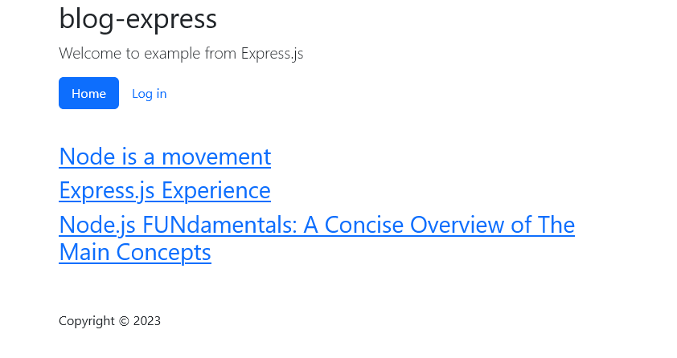

# The Blog Project

The Blog app consists of five main parts.

- A home page with a list of articles.
- An individual article page with the full-text article
- An admin page for publishing and removing content
- A login page for accessing the aforementioned admin page
- A post article page for adding new content

## Prerequisites

- Node.js 14
- Express 4.18
- A certificate with its private key.

## Getting started

1. Clone the project.
1. Open a terminal in the root directory.
1. Change to `blogapp` directory.
1. Generate a certificate `server.crt` with private key `server.key` in `src` directory ([How-to][1])
1. Run `npm install`.
1. Run `npm start`.
1. Open your web browser at <https://localhost:8000/>.

[1]: https://gist.github.com/feliperomero3/a6282b0e7ca579fff0e296227675190d
